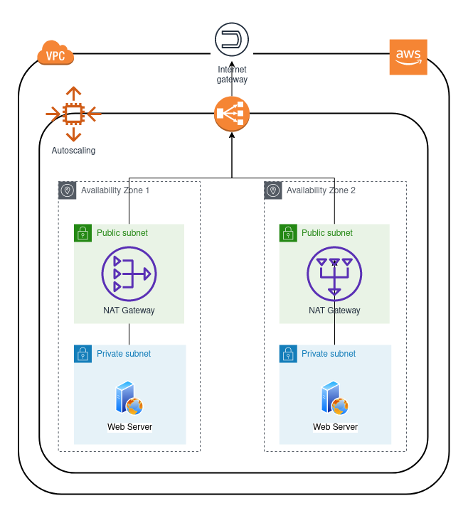

# **Immutable Web Server Application Load Balancer**

Creates an immutable two web servers on private networks. The web servers accept requests through the application load balancer and these ones are available through NAT gateways.

## **Author**

Jorge Alvarez <alvarez.jeap@gmail.com>

## **Requirements**

- [Terraform](https://www.terraform.io/) 0.12+
- AWS Account
  - Access and secret keys

## **Infrastructure Diagram**



## **Playground**

- Create an ssh key

```sh
ssh-keygen -t rsa -C "" -f ./ssh-keys/aws_testing -q -N ""
```

- Create

```sh
terraform apply --auto-approve \
    -var "ssh_private_key_path=${SSH_PRIVATE_KEY_PATH}" \
    -var "aws_access_key=${AWS_ACCESS_KEY}" \
    -var "aws_secret_key=${AWS_SECRET_KEY}"
```

**Note. `SSH_PRIVATE_KEY_PATH` should be the absoulte path.**

- Destroy

```sh
terraform destroy --auto-approve \
    -var "ssh_private_key_path=${SSH_PRIVATE_KEY_PATH}" \
    -var "aws_access_key=${AWS_ACCESS_KEY}" \
    -var "aws_secret_key=${AWS_SECRET_KEY}"
```

**Note. `SSH_PRIVATE_KEY_PATH` should be the absoulte path.**
